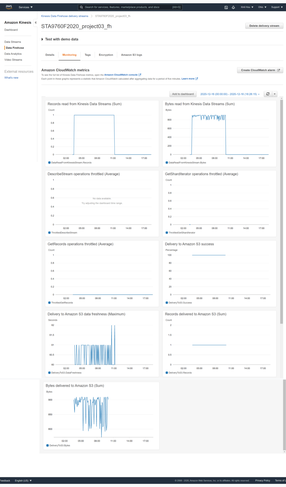

# Streaming Finance Data with AWS Lambda

For this project, I provisioned a Lambda function to generate near real time finance data records for interactive querying. In lambda, I used the **[yfinance](https://pypi.org/project/yfinance/)** module to grab pricing information for each of the following 10 stocks: 

Facebook (FB), Shopify (SHOP), Beyond Meat (BYND), Netflix (NFLX), Pinterest (PINS), Square (SQ), The Trade Desk (TTD), Okta (OKTA), Snap (SNAP), Datadog (DDOG).

I collected **one full day’s worth of stock HIGH and LOW prices** for each company listed above **on Tuesday, December 1st 2020**, at a **five** **minute interval** using the **Cloudwatch Events** trigger on Lambda. This project consists of three major infrastructure elements that work in tandem:

* A lambda function that gathers our data (**DataTransformer**)

* A Kinesis stream that holds our data (**DataCollector**)

* A serverless process that allows us to query our S3 data (**DataAnalyzer**)

## Data Collection: AWS Kinesis

* create data stream

  **stream name**: STA9760F2020_project03

* process with delivery stream

  **delivery stream name**: STA9760F2020_project03_fh

  **s3 bucket name**: sta9760f2020xinliproject03

  

## Data Transformation: AWS Lambda

* create function: runtime python3.8

  **function name**: sta9760f2020_project03

* add layer: yfinance

* lambda function: put_record to stream (STA9760F2020_project03)

* basic setting: time out = 5min

* IAM roles:  attach policies
  * kinesisfullaccess
  * kinesisfirehosefullaccess
  * KinesisFirehoseServicePolicy-STA9760F2020_project03_fh-us-east-2

* add trigger: EventBridge (CloudWatch Events)

  **rule**: every 5 minutes

## Data Analysis: AWS Athena

* set up an S3 bucket and a folder in it for Athena to store query results.

  **bucket name**: sta9760-athena-queries-project03

  **folder**: athena

* set up a Glue crawler and add a tale using a crawler which connected to s3 bucket (sta9760f2020xinliproject03) so that I can run AWS Athena queries against the data. 

  **crawler name**: sta9760f2020project03

  **IAM role**: sta9760f2020project03

  **add a new database**: project03

* in Athena, select this database "project03", then write and run a query that outputs the highest hourly stock “high” per company from the list above.

## Kinesis Data Firehose Delivery Stream Monitoring 

